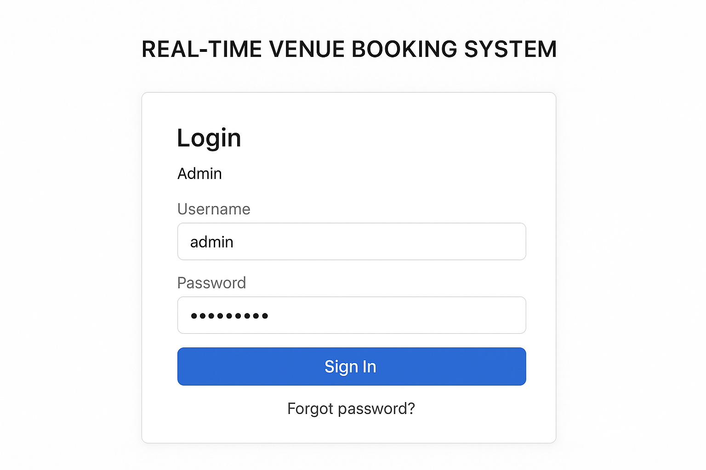
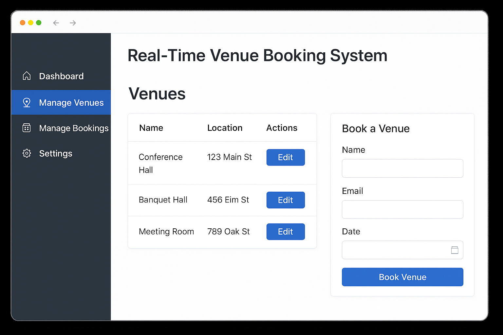
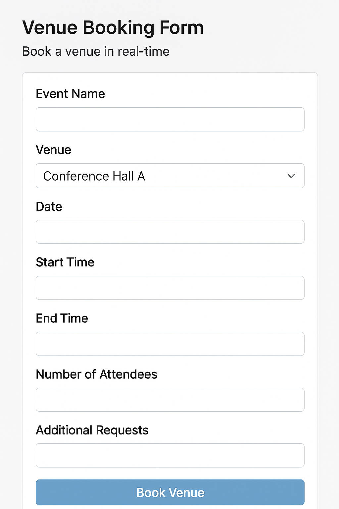

# Real Time Venue Booking System

A web-based system that allows administrators and users to manage and book venues in real time.  
Built with **PHP**, **MySQL**, **Bootstrap**, **HTML**, **CSS**, and **JavaScript**.

## 🚀 Features
- Secure **admin login** system
- Venue booking and management
- Real-time availability updates
- Responsive interface using **Bootstrap**
- Database integration with **MySQL**
- Easy navigation with a clean UI


## 📂 Project Structure
project/ │── css/ │   ├── bootstrap.css │   ├── style.css │ │── js/ │   ├── jquery.js │   ├── bootstrap.js │ │── connect.php          # Database connection file │── login.php            # Login authentication logic │── index.php            # Admin login page (entry point) │── venue_booking.sql    # Database schema (exported SQL file)

## ⚙️ Installation & Setup
1. **Clone the repository**
   ```bash
   git clone https://github.com/your-username/venue-booking-system.git
   cd venue-booking-system

   2. Setup the Database

Import venue_booking.sql into your MySQL server.

Update connect.php with your database credentials:

<?php
$conn = new mysqli("localhost", "root", "", "venue_booking");
if ($conn->connect_error) {
    die("Connection failed: " . $conn->connect_error);
}
?>
Create an Admin Account After importing the database, insert your own admin account into the admin table:

INSERT INTO admin (username, password) 
VALUES ('your-username', MD5('your-password'));

Note: Replace your-username and your-password with your own secure credentials.
You can use a stronger hash (e.g., bcrypt) in production.


3. Run the Project

Place the project folder inside your web server root (htdocs for XAMPP, www for WAMP, etc.).

Start Apache and MySQL in XAMPP/WAMP.

Open in browser:

http://localhost/venue-booking-system/index.php

## 📸 Screenshots

### Admin Login Page


### Admin Dashboard


### Venue Booking Form


---

📌 **Contributor Note**  
- Store all screenshots in the `screenshots/` folder (same level as `README.md`).  
- Use **clear, lowercase filenames** with hyphens (e.g., `login.png`, `dashboard.png`, `booking-form.png`).  
- Keep images optimized (compressed) to reduce repository size.  
- Add meaningful alt text when referencing screenshots in the README for accessibility.


